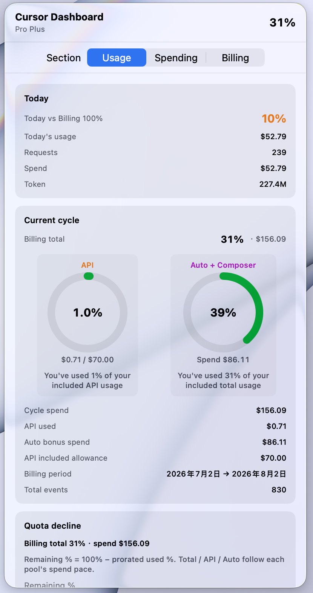
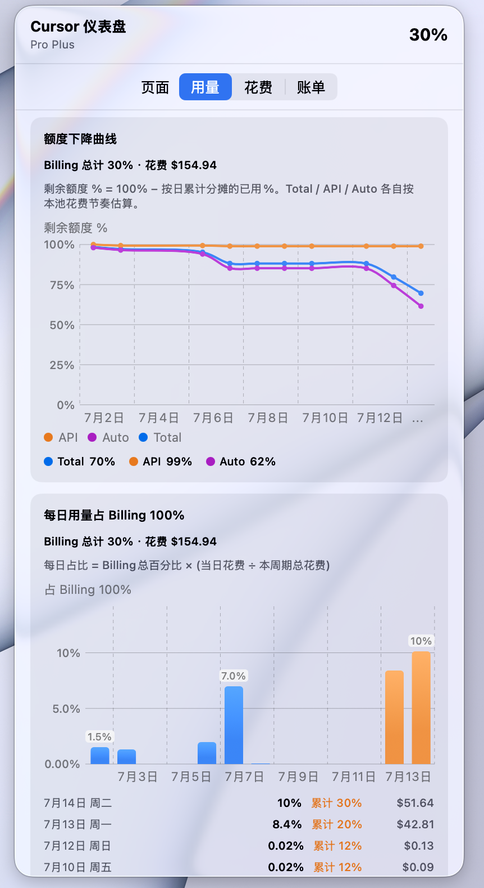
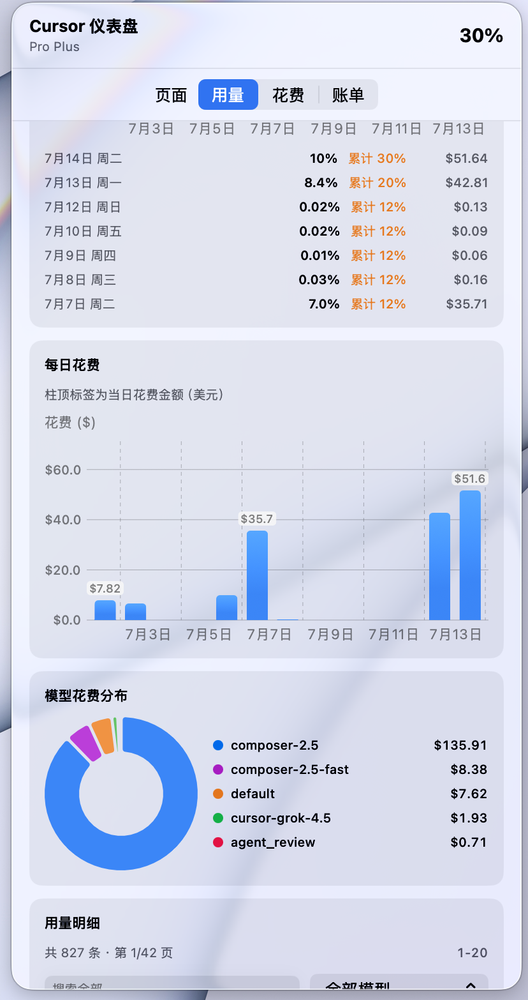
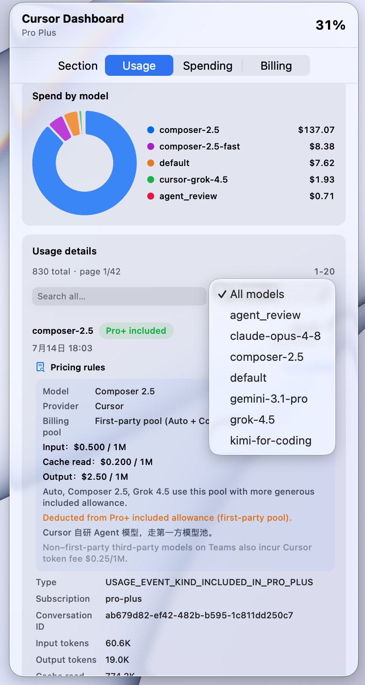
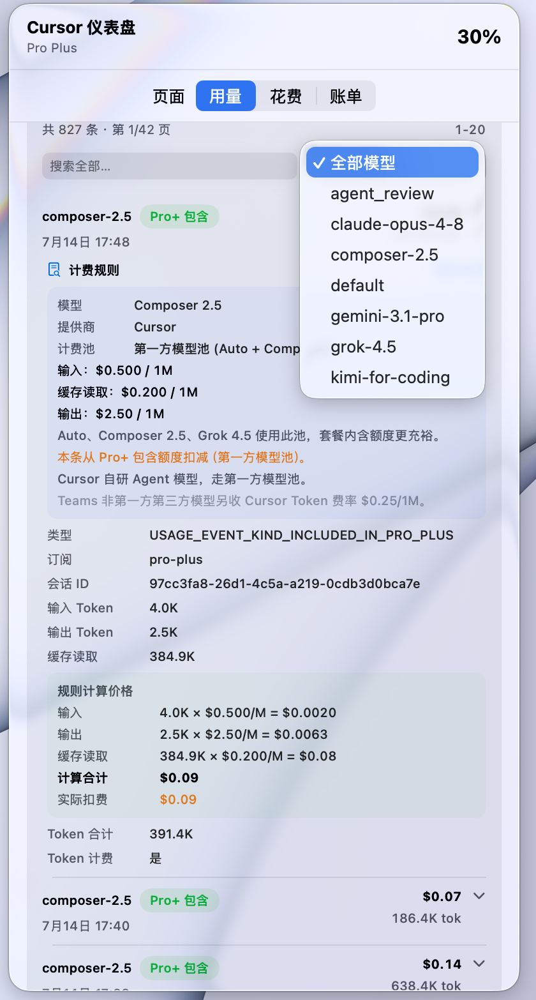
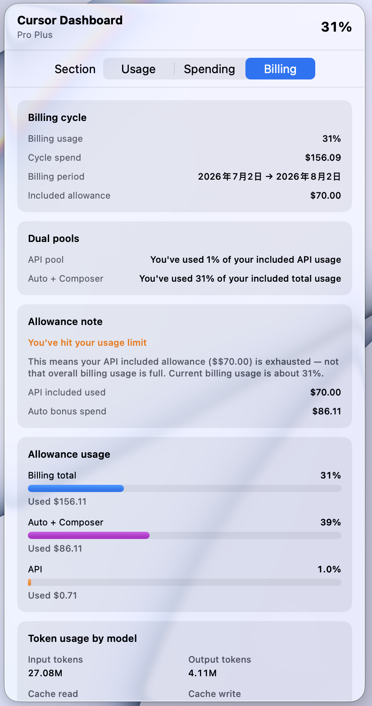
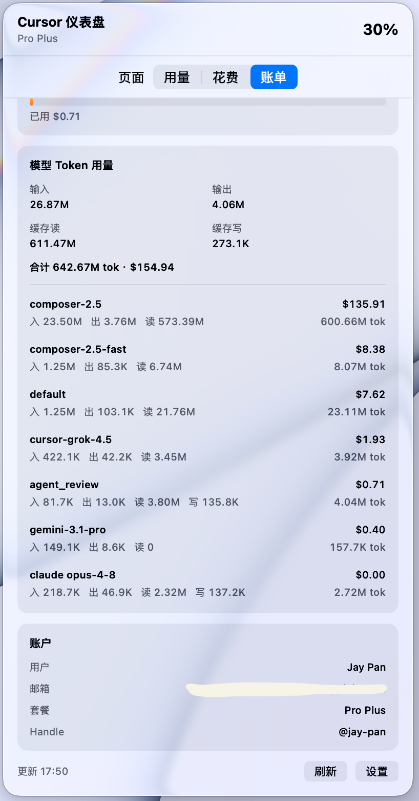
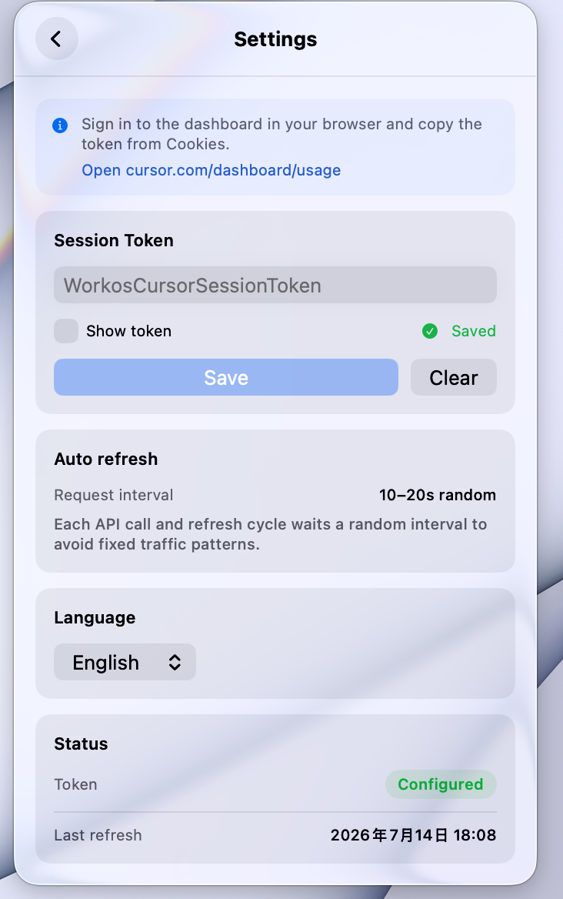

# cursor-usage-menu-bar

<p align="center">
  Native macOS menu bar app for <a href="https://cursor.com">Cursor</a> usage, spending, and billing — SwiftUI dashboard with dual-pool analytics, charts, and EN/ZH i18n.
</p>

<p align="center">
  <strong>中文文档</strong> · <a href="README.zh.md">README.zh.md</a>
</p>

<p align="center">
  <a href="https://github.com/pj-workspace/cursor-usage-menu-bar/actions/workflows/build.yml"></a>
  &nbsp;
  <a href="LICENSE"></a>
  &nbsp;
  <a href="https://developer.apple.com/macos/"></a>
  &nbsp;
  <a href="https://swift.org"></a>
</p>

<p align="center">
  <sub>
    <code>cursor</code> · <code>macos</code> · <code>menu-bar</code> · <code>swift</code> · <code>swiftui</code> · <code>usage-tracker</code> · <code>billing</code> · <code>developer-tools</code> · <code>menubar-extra</code> · <code>cursor-ide</code>
  </sub>
</p>

---

## Preview

<p align="center">
  
</p>
<p align="center"><sub><b>Usage</b> — today stats, API / Auto + Composer pools, billing cycle overview</sub></p>

### Charts & analytics

<table>
  <tr>
    <td width="50%" valign="top" align="center">
      
      <br><sub>Quota decline — Total / API / Auto</sub>
    </td>
    <td width="50%" valign="top" align="center">
      
      <br><sub>Daily spend (USD) · model breakdown</sub>
    </td>
  </tr>
</table>

### Events & pricing

<table>
  <tr>
    <td width="50%" valign="top" align="center">
      
      <br><sub>Paginated events · model filter</sub>
    </td>
    <td width="50%" valign="top" align="center">
      
      <br><sub>Token breakdown · pricing rules & estimates</sub>
    </td>
  </tr>
</table>

### Billing & account

<table>
  <tr>
    <td width="50%" valign="top" align="center">
      
      <br><sub><b>Billing</b> — cycle usage, dual-pool status</sub>
    </td>
    <td width="50%" valign="top" align="center">
      
      <br><sub>Per-model tokens · account & plan</sub>
    </td>
  </tr>
</table>

### Settings

<p align="center">
  
</p>
<p align="center"><sub>Session token · auto-refresh · <b>Language: System / English / 中文</b></sub></p>

<p align="center"><sub>More screenshots → <a href="docs/screenshot/en/">docs/screenshot/en</a> · <a href="docs/screenshot/zh/">docs/screenshot/zh</a></sub></p>

---

## Features

- **Menu bar at a glance** — billing cycle usage % with a live gauge icon
- **Three-tab dashboard** aligned with Cursor's web dashboard:
  - **Usage** — today stats, dual pools, quota decline curve, daily charts, paginated events
  - **Spending** — cycle spend, breakdown bars, spend trends
  - **Billing** — cycle summary, dual-pool status, allowance notes, per-model token usage
- **Dual usage pools** — API included allowance vs Auto + Composer bonus; clarifies misleading *usage limit* messages
- **Charts** — daily spend (USD), daily usage %, quota decline (Total / API / Auto), model pie chart
- **Usage event details** — tokens, pricing rules, cost estimates, full-cycle local cache
- **Background sync** — randomized 10–20s request pacing
- **Change notifications** — in-app banner + macOS alerts on usage shifts
- **Bilingual UI** — English & 中文 (Settings → Language)
- **Keychain** — `WorkosCursorSessionToken` stored securely

---

## Requirements

- macOS 14.0 (Sonoma) or later
- Swift 5.9+ / Xcode 15+ (build from source)

---

## Quick start

### 1 · Get your session token

1. Sign in at [cursor.com/dashboard/usage](https://cursor.com/dashboard/usage)
2. DevTools → **Application** → **Cookies** → `cursor.com`
3. Copy **`WorkosCursorSessionToken`**

> Uses Cursor's **undocumented dashboard APIs** — may change without notice. **Never commit or share your token.**

### 2 · Build & run

```bash
git clone https://github.com/pj-workspace/cursor-usage-menu-bar.git
cd cursor-usage-menu-bar
chmod +x scripts/build-app.sh
./scripts/build-app.sh release
open dist/CursorUsageMenuBar.app
```

Paste the token in **Settings → Session Token → Save**.

### Development

```bash
swift run
# or: open Package.swift
```

---

## How usage is calculated

Cursor exposes **two billing pools**:

| Pool | Source | Shown as |
|------|--------|----------|
| **API** | Named / third-party models | % of API included allowance ($70 on Pro+) |
| **Auto + Composer** | Auto-routed & Composer models | Bonus spend on top of included API |

**Billing total** (`totalPercentUsed`) is the menu bar headline. *"You've hit your usage limit"* usually means **API included allowance is exhausted**, not that overall billing is at 100%.

Daily charts prorate billing % by each day's share of cycle spend.

---

## API endpoints

| Area | Endpoint | Purpose |
|------|----------|---------|
| Usage | `GET /api/usage-summary` | Cycle limits, dual-pool % |
| Usage | `POST /api/dashboard/get-filtered-usage-events` | Paginated events |
| Usage | `POST /api/dashboard/get-aggregated-usage-events` | Per-model token totals |
| Spending | `POST /api/dashboard/get-current-period-usage` | Cycle spend & pools |
| Billing | `POST /api/dashboard/get-user-profile` | Profile & handle |
| Billing | `GET /api/auth/me` | Email & name |

---

## Project structure

```
cursor-usage-menu-bar/
├── Package.swift
├── Resources/Info.plist
├── scripts/build-app.sh
├── docs/screenshot/{en,zh}/
└── Sources/CursorUsageMenuBar/
    ├── Localization/
    ├── Models/
    ├── Services/
    ├── ViewModels/
    └── Views/
```

---

## Releases

Download binaries from **[GitHub Releases](https://github.com/pj-workspace/cursor-usage-menu-bar/releases)**.

| Version | Notes |
|---------|-------|
| [v0.1.0](https://github.com/pj-workspace/cursor-usage-menu-bar/releases/tag/v0.1.0) | Initial release — dashboard, charts, i18n |

---

## Disclaimer

**Not affiliated with Cursor.** Independent community tool. Session tokens are credentials — treat them like passwords.

---

## License

[MIT](LICENSE) © 2026 Jay Pan
