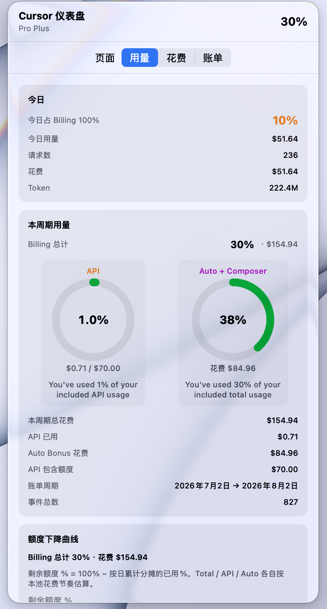
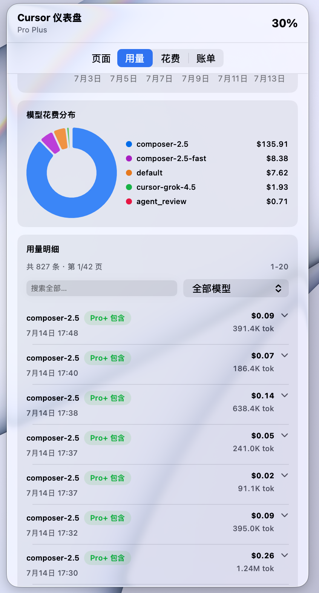
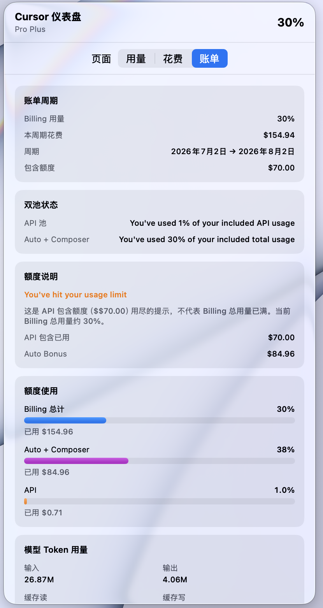
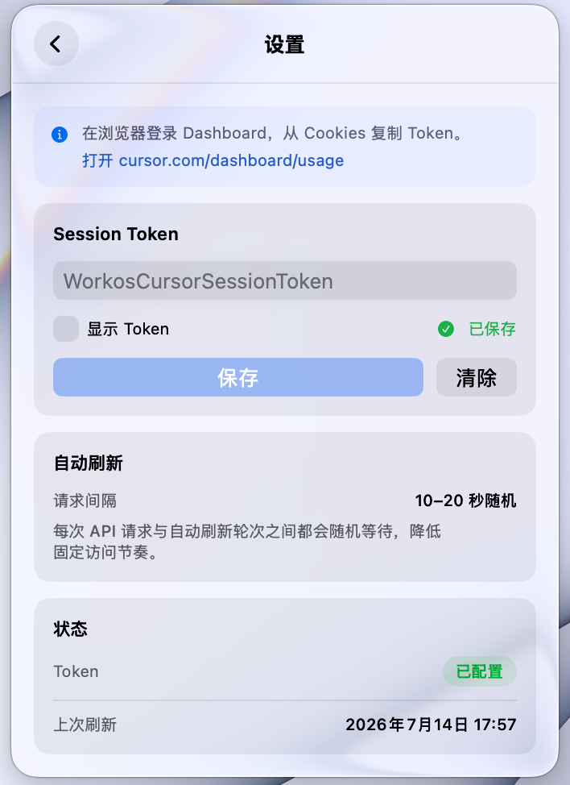

# cursor-usage-menu-bar

原生 macOS 菜单栏应用，在本地展示 [Cursor](https://cursor.com) 用量、花费与账单 — SwiftUI 三页仪表盘、双用量池分析、图表与中英双语。

> **English** · [README.md](README.md)

[](https://github.com/pj-workspace/cursor-usage-menu-bar/actions/workflows/build.yml)
[](LICENSE)
[](https://developer.apple.com/macos/)
[](https://swift.org)

`cursor` · `macos` · `menu-bar` · `swift` · `swiftui` · `usage-tracker` · `billing` · `developer-tools` · `menubar-extra` · `cursor-ide`

---

## 预览

<p align="center">
  
</p>
<p align="center"><sub><b>用量</b> — 今日统计、API / Auto + Composer 双池、本周期花费</sub></p>

---

### 额度下降曲线 & 每日用量

<p align="center">
  
</p>
<p align="center"><sub>Total / API / Auto 三条额度曲线 · 每日占 Billing 100% 柱状图</sub></p>

---

### 每日花费 & 模型分布

<p align="center">
  
</p>
<p align="center"><sub>柱顶美元标签 · 按模型花费占比</sub></p>

---

### 用量明细 & 计费规则

<p align="center">
  
</p>
<p align="center"><sub>全量缓存筛选 · 分页明细 · 模型花费分布</sub></p>

<p align="center">
  
</p>
<p align="center"><sub>展开单条 — 官方计费规则与规则计算价格</sub></p>

---

### 账单 & 模型 Token

<p align="center">
  
</p>
<p align="center"><sub><b>账单</b> — 周期用量、双池状态、API 额度用尽说明</sub></p>

<p align="center">
  
</p>
<p align="center"><sub>按模型 Token 汇总 · 账户与套餐</sub></p>

---

### 设置

<p align="center">
  
</p>
<p align="center"><sub>Session Token · 自动刷新间隔 · <b>语言：跟随系统 / English / 中文</b></sub></p>

> 全部截图：[`docs/screenshot/zh/`](docs/screenshot/zh/) · [`docs/screenshot/en/`](docs/screenshot/en/)

---

## 功能

- **菜单栏一眼看用量** — 本周期 Billing 百分比 + 动态仪表盘图标
- **三页仪表盘**，对齐 Cursor 官网：
  - **用量** — 今日、双池、额度曲线、每日图表、用量明细分页
  - **花费** — 本周期花费、花费占比、花费趋势
  - **账单** — 周期摘要、双池状态、额度说明、模型 Token、账户
- **双用量池** — API 包含额度 vs Auto + Composer；澄清误导性的 *usage limit* 提示
- **图表** — 每日花费（美元）、每日用量 %、额度下降（Total / API / Auto）、模型饼图
- **用量明细** — Token、计费规则、规则估价、全周期本地缓存加速筛选分页
- **后台同步** — 10–20 秒随机间隔，降低固定访问节奏
- **变化提醒** — 用量变动时应用内横幅 + 系统通知
- **中英双语** — 设置 → 语言
- **Keychain** — Token 安全存储

---

## 环境要求

- macOS 14.0（Sonoma）及以上
- Swift 5.9+ / Xcode 15+（源码构建）

---

## 快速开始

### 1 · 获取 Session Token

1. 登录 [cursor.com/dashboard/usage](https://cursor.com/dashboard/usage)
2. 开发者工具 → **Application** → **Cookies** → `cursor.com`
3. 复制 **`WorkosCursorSessionToken`**

> 使用 Cursor **未公开**的 Dashboard API，可能随时变更。**切勿提交或泄露 Token。**

### 2 · 构建运行

```bash
git clone https://github.com/pj-workspace/cursor-usage-menu-bar.git
cd cursor-usage-menu-bar
chmod +x scripts/build-app.sh
./scripts/build-app.sh release
open dist/CursorUsageMenuBar.app
```

在 **设置 → Session Token → 保存** 中粘贴 Token。

### 开发调试

```bash
swift run
# 或：open Package.swift
```

---

## 用量计算说明

Cursor 有两个计费池：

| 池 | 含义 | 展示 |
|----|------|------|
| **API** | 手动选择的第三方模型 | API 包含额度占比（Pro+ 约 $70） |
| **Auto + Composer** | 自动路由与 Composer | Bonus 花费 |

菜单栏显示 **Billing 总计**（`totalPercentUsed`）。出现 *You've hit your usage limit* 通常表示 **API $70 包含额度用尽**，不代表 Billing 总用量已满。

每日图表按「当日花费 ÷ 本周期总花费」分摊 Billing 总百分比。

---

## API 接口

| 页面 | 接口 | 用途 |
|------|------|------|
| 用量 | `GET /api/usage-summary` | 周期额度、双池 % |
| 用量 | `POST /api/dashboard/get-filtered-usage-events` | 明细分页 |
| 用量 | `POST /api/dashboard/get-aggregated-usage-events` | 各模型 Token |
| 花费 | `POST /api/dashboard/get-current-period-usage` | 周期花费 |
| 账单 | `POST /api/dashboard/get-user-profile` | 资料 |
| 账单 | `GET /api/auth/me` | 邮箱与名称 |

---

## 仓库结构

```
cursor-usage-menu-bar/
├── Package.swift
├── Resources/Info.plist
├── scripts/build-app.sh
├── docs/screenshot/{en,zh}/
└── Sources/CursorUsageMenuBar/
    ├── Localization/
    ├── Models/
    ├── Services/
    ├── ViewModels/
    └── Views/
```

---

## 截图索引

| 文件 | 说明 |
|------|------|
| `usage-tab-overview.png` | 用量页总览 |
| `quota-decline-and-daily-charts.png` | 额度曲线 + 每日用量 |
| `daily-spend-and-model-chart.png` | 每日花费 + 模型分布 |
| `model-distribution-and-events.png` | 明细列表与筛选 |
| `usage-events-pricing-detail.png` | 计费规则详情 |
| `billing-tab-overview.png` | 账单页 |
| `model-token-usage-and-account.png` | Token 用量 + 账户 |
| `settings.png` | 设置 |

---

## 发布

预编译包：**[GitHub Releases](https://github.com/pj-workspace/cursor-usage-menu-bar/releases)**

| 版本 | 说明 |
|------|------|
| [v0.1.0](https://github.com/pj-workspace/cursor-usage-menu-bar/releases/tag/v0.1.0) | 首次开源 — 仪表盘、图表、双语 |

---

## 免责声明

**与 Cursor 官方无关。** 独立社区工具，使用风险自负。Token 等同于账号凭证，请妥善保管。

---

## 许可证

[MIT](LICENSE) © 2026 Jay Pan
